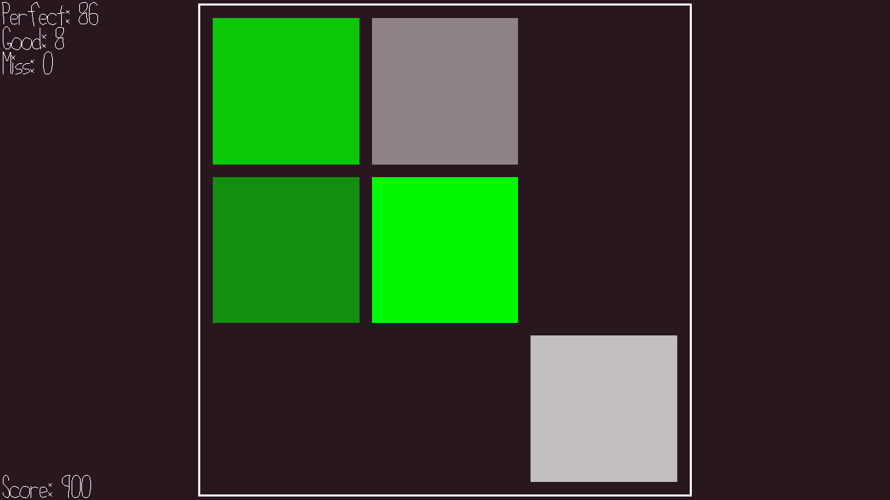

# RNGubeat (Definitely Not a Worse Jubeat-Osu Hybrid)

Author: Anne He

Design: A rhythm game where you must hit or click the buttons in time to the music. 
However, you can upload any music track and the beats will be automatically processed (albeit in a stupid way) and the key mappings are randomly generated.

Screen Shot:

How To Play:

Run the game with the file name or path to a .wav or .opus file relative to the game dist.
Use numpad or QWE/ASD/ZXC for each button. Or, click on the squares with your mouse.
The keys coming up will increase in opacity until the moment of the beat, then decrease in opacity. Try to hit when it is the brightest.
The key will turn green if you hit it near perfectly, yellow if it's okay, and red if it's not close at all. Misses will also be counted in this category, but it will not appear red unless you pressed it, to avoid confusion.

The bpm is limited to 240, or 4 notes per second. This is to make it playable, since it is hard to tell which button is for what when all the squares are constantly going.

What I learned out of this game was 1. why a rhythm game with randomly placed beats sucks 2. why rhythm games don't use keyboard controls for more than 4 buttons.
If you want the notes to be somewhat predictable comment out the srand on line 112.

Sources: Used 15-466 Game 3 and Game 0 base code.

Bit Bit Loop by Kevin MacLeod, found on freepd.com. Creative Commons 0.

Dusty Floor by Jim McCann, derived from Game 3 base code.

Did not include additional music out of fear of copyright, but is a lot of fun.

This game was built with [NEST](NEST.md).

